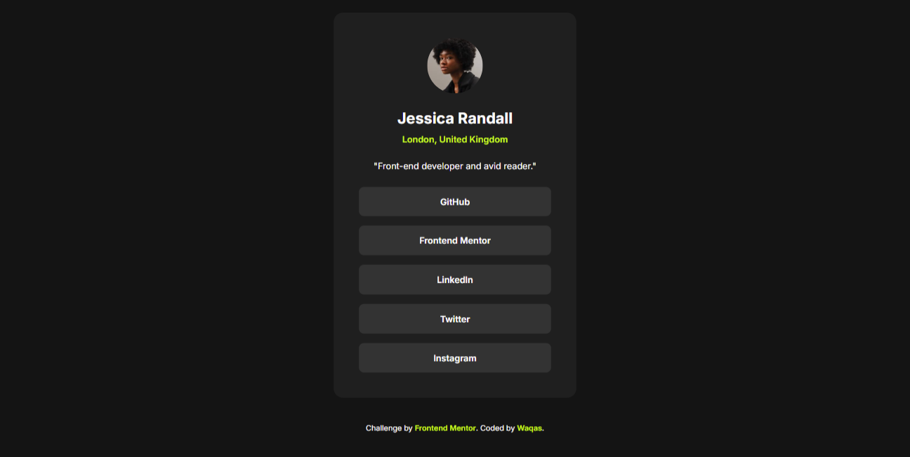
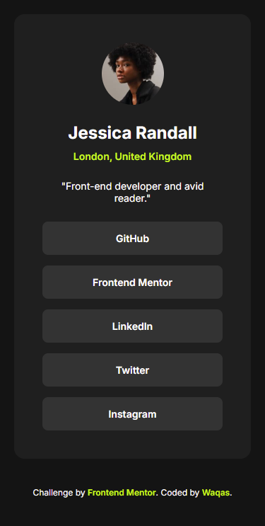

# Frontend Mentor - Social links profile solution

This is a solution to the [Social links profile challenge on Frontend Mentor](https://www.frontendmentor.io/challenges/social-links-profile-UG32l9m6dQ). Frontend Mentor challenges help you improve your coding skills by building realistic projects. 

## Table of contents

- [Overview](#overview)
  - [The challenge](#the-challenge)
  - [Screenshot](#screenshot)
  - [Links](#links)
- [My process](#my-process)
  - [Built with](#built-with)
  - [What I learned](#what-i-learned)
  - [Continued development](#continued-development)
  - [AI Collaboration](#ai-collaboration)
- [Author](#author)

## Overview

### The challenge

Users should be able to:

- See hover and focus states for all interactive elements on the page

### Screenshot

### Screenshot

**Desktop View:**


**Mobile View:**


### Links

- Solution URL: [Add solution URL here](https://your-solution-url.com)
- Live Site URL: [Add live site URL here](https://your-live-site-url.com)

## My process

### Built with

- Semantic HTML5 markup
- CSS custom properties (Variables)
- CSS Flexbox
- Mobile-first workflow
- Universal Box Sizing

### What I learned

Use this section to recap over some of your major learnings while working through this project. Writing these out and providing code samples of areas you want to highlight is a great way to reinforce your own knowledge.

To see how you can add code snippets, see below:

```css
body {
    display: flex; 
    flex-direction: column;
    justify-content: center;
    align-items: center;
    min-height: 100vh; /* Ensures perfect vertical centering */
}

.links {
    display: flex;
    flex-direction: column;
    gap: 15px; /* Cleanly spaces the anchor tags */
}
```


### Continued development

In future projects, I want to continue refining my use of responsive design techniques, ensuring that components scale fluidly between mobile (375px) and desktop (1440px) layouts without relying on hardcoded percentage widths. I also plan to explore more advanced CSS Grid layouts for complex UI components.

### Useful resources

- [Example resource 1](https://www.example.com) - This helped me for XYZ reason. I really liked this pattern and will use it going forward.
- [Example resource 2](https://www.example.com) - This is an amazing article which helped me finally understand XYZ. I'd recommend it to anyone still learning this concept.

**Note: Delete this note and replace the list above with resources that helped you during the challenge. These could come in handy for anyone viewing your solution or for yourself when you look back on this project in the future.**

### AI Collaboration

Tool: Gemini

Use Case: Code review, debugging layout inconsistencies (such as vertical centering and container constraints), and ensuring strict adherence to the provided design style guide (typography and colors).

Outcome: Streamlined the debugging process and reinforced best practices for semantic HTML and CSS Flexbox structures.

## Author

Name - Muhammad Waqas Siddique

Frontend Mentor - @battleshopventureswaqas-blip

GitHub - Add your GitHub profile URL here

# Social-links-profile
